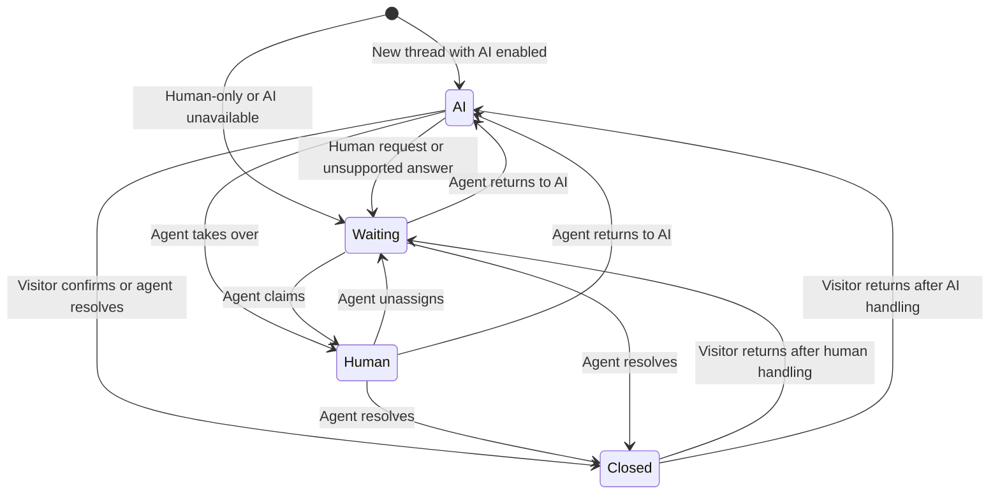

# Sema — Product Requirements Document

**Version:** 1.0 · **Date:** 5 October 2026 · **Status:** Draft for product and engineering review  
**Release:** Website support MVP · **Product owner:** Sema founder  
**Inputs:** `sema-idea.md`, `architecture.png`, `flows.png`  
**Method:** RefoundAI `writing-prds` skill: problem first, measurable outcomes, bounded scope, and testable requirements.

> Sema helps Kenyan businesses answer website visitors using their own knowledge, with a human ready to take over and predictable billing in Kenyan shillings.

## 1. Product brief

### Problem

Website visitors cannot reliably get timely, accurate answers to routine business questions, while small support teams spend time repeating the same information and lose context when a question needs personal attention.

This is a **problem hypothesis**, not a finding from completed research. The supplied materials establish a product direction; they do not establish support volumes, willingness to pay, or demand for website chat relative to other channels.

### Proposed solution and initial customer

A business installs Sema's widget, uploads support documents, and handles conversations in a shared inbox. AI answers questions supported by those documents. Unsupported questions and requests for a person enter a human queue with their history intact. The business pays a monthly prepaid subscription through M-Pesa.

Start with Kenyan online shops or service businesses with active websites, recurring policy/service questions, usable support documents, and someone responsible for customer support. Choose one initial segment after discovery. Businesses whose customer contact happens entirely outside their website are not the initial target.

### Why this direction

The widget provides one clear entry point. Document-based answers make the AI's scope understandable. Human handoff protects the experience when automation is insufficient. KES pricing and M-Pesa are local product hypotheses to validate. Website support keeps the first release focused enough to test end to end.

### Outcome and decision rules

A business can install Sema on a real website, receive grounded English or Kiswahili answers, take over conversations, pay for access, and see remaining usage. Visitors understand who is responding and whether a human is available.

- Prefer an honest handoff over an unsupported answer.
- Preserve messages and ownership through disconnects, retries, and takeovers.
- Make prices and limits understandable before purchase.
- Keep live chat, AI, human handoff, and billing in the first release.
- Defer features that do not improve activation, support quality, or paid retention.

**Planning proposal:** An eight-week build appetite followed by a four-week supervised pilot. This is a constraint to review after technical spikes, not an engineering estimate or committed launch date.

## 2. Evidence and interpretation of the inputs

| Input | What it establishes | Use in this PRD |
| --- | --- | --- |
| `sema-idea.md` | Kenyan focus, chat, RAG, guardrails, team inbox, proposed plans, M-Pesa, exclusions | Product scope and starting commercial assumptions |
| `architecture.png` | Iframe/visitor token, Next.js orchestration, Better Auth, PartyKit, OpenAI embeddings, Postgres/pgvector, uploads and ingestion, environment branches | Directional architecture and trust boundaries |
| `flows.png` | A: upload and index; B: validate, classify, retrieve, answer, deliver; C: AI, waiting, human, closed | Core journeys and conversation lifecycle |
| `writing-prds` skill | Problem clarity, success measures, boundaries, concise briefing, acceptance tests | Document structure and review method |

The diagrams use MarshalDesk; this PRD uses **Sema** throughout. Auth, AI gateway, functions, and storage appear inside a Neon box. Treat that as a logical grouping, not confirmation that one vendor supplies every capability. Resolve provider choices and runtime limits before implementation.

**Proposed refinements:** explicit state transitions, safe AI publication during takeover, quality gates, upload limits, defined grace behavior, atomic usage accounting, and retention defaults. These are product proposals introduced by this PRD.

No interviews, production measurements, vendor cost model, or legal review were supplied. Numerical targets below are starting points to validate, not observed results.

## 3. Users, jobs, and permissions

| Role | Job to be done | Access |
| --- | --- | --- |
| Visitor | Get an accurate answer or reach a person without repeating the question | Own website session and conversations; no account required |
| Workspace owner | Launch reliable support, maintain its knowledge, and control spending | Settings, knowledge, team, conversations, billing, export, deletion requests |
| Support agent | See who needs help and respond with the necessary context | Inbox, assignment, internal notes, resolution, answer source references |
| Sema operator | Operate the service and investigate failures | Operational metadata; restricted, audited content access when necessary |

Each workspace has one owner in v1. The owner counts as a seat. Agents cannot change knowledge, billing, domains, or membership. Optional visitor contact details are unverified and must not establish account ownership.

A workspace represents one business. Its websites share knowledge, team, subscription, and allowances. Separate brands with conflicting policies need separate workspaces; website-specific knowledge permissions are deferred.

## 4. Goals and success measures

Run a four-week pilot with at least five recruited businesses. Report raw counts with percentages because the sample is small.

| Measure | Definition | Proposed target |
| --- | --- | --- |
| Activation | Ready document, verified live installation, and a non-test conversation within seven days of signup | At least 4 of 5 businesses |
| Answer quality | Reviewed answers are correct, relevant, and fully supported by active sources | At least 95% of 100 or more sampled answers; report each language separately |
| Useful support outcome | Reviewed on-topic conversations resolved by AI or a human without a material incorrect answer | At least 80% of 100 or more reviewed conversations; unresolved/abandoned eligible threads remain in denominator |
| Willingness to pay | Businesses purchase a paid month at a published pilot price | At least 3 of 5 after trial; disclose discounts |
| Delivery cost | AI, indexing, real-time, storage, hosting allocation, and payment fees divided by revenue excluding tax | At or below 30% at expected plan usage; a viability hypothesis |

Staff resolution labels alone do not prove accuracy. Review transcripts against the source versions used. Do not infer AI resolution merely because a visitor stopped replying.

**Release guardrails:** zero known cross-workspace exposure, unauthorized conversation access, duplicate payment application, or AI replies published after completed human takeover. Any such defect blocks release regardless of commercial results.

## 5. Scope and priorities

**P0:** required for the first paid pilot. **P1:** can follow after the core service is reliable.

| P0 — paid pilot | P1 — later iteration |
| --- | --- |
| Signup, workspace, invitations, owner/agent permissions | More sign-in methods, self-service ownership transfer |
| Iframe widget, visitor sessions, reliable real-time text messaging | Visitor attachments, rich messages |
| Inbox, assignments, notes, resolve/reopen, handoff | Advanced search, tags, saved replies, automated routing |
| PDF/DOCX/TXT/Markdown ingestion, replacement, deletion, test chat | OCR, crawling, more formats |
| Classification, grounded English/Kiswahili AI, staff source references | More languages and tuning tools |
| KES plans, M-Pesa, trial, renewal, plan changes, limits, receipts | Annual plans, cards, automatic renewals, overages, add-ons |
| Basic reports, support hours, operational tools, export/deletion handling | Advanced analytics and configurable retention |

**Outside v1:** email support, ticketing, public help center, product tours, campaigns, WhatsApp/SMS/social inboxes, native mobile apps, voice, and AI actions on orders, refunds, or bookings. Transactional invitations and billing emails are permitted; they do not create an email support channel.

## 6. End-to-end journeys

### A. Activate a business

1. Owner signs in, creates a workspace, and starts its single 14-day trial.
2. Owner enters business details, fallback contact, support hours, and website domain.
3. Owner uploads knowledge and sees processing status.
4. Owner tests a supported question, an unsupported question, and human handoff.
5. Owner installs the script and verifies an actual connection from the approved website.
6. Owner enables AI once a document is ready. Human-only chat can work beforehand.
7. Owner invites agents within seat limits and handles a real conversation.

A persistent checklist tracks progress. Copying the snippet alone does not count as installation. Test chat and installation checks do not create billable visitor conversations.

### B. Upload knowledge — diagram Flow A

1. Sema checks owner permissions and limits, then issues a scoped, short-lived upload URL.
2. Browser uploads directly to private object storage.
3. Sema validates completion and queues ingestion.
4. Worker extracts text, chunks it, generates embeddings, and saves workspace-scoped chunks/vectors.
5. The complete document version becomes searchable and its status changes to ready.

Failures display a reason and retry action. Replacement leaves the old version active until the new one succeeds, then switches atomically. Deletion immediately excludes content from retrieval and schedules byte/vector removal.

### C. Answer a visitor — diagram Flow B

1. Widget obtains a server-issued token bound to its website and workspace.
2. Server checks the visitor, conversation state, limits, and entitlement.
3. Server durably stores and acknowledges the message; retries reuse its identifier.
4. Waiting/human-owned conversations notify staff without invoking AI.
5. AI-owned conversations route the message using recent public conversation context.
6. Eligible questions are embedded; retrieval searches active knowledge in that workspace only.
7. Sema generates and validates an evidence-based answer, commits it, and delivers through the real-time channel.
8. Missing, weak, or conflicting evidence produces clarification or human handoff.

Greetings and fixed off-topic replies bypass knowledge generation. Explicit human requests bypass classification and retrieval. No external action is performed by AI in v1.

### D. Human takeover — diagram Flow C

1. Visitor asks for a person, AI cannot answer, or an agent takes over.
2. State changes invalidate pending AI output and record the reason.
3. Inbox shows transcript, handoff reason, and an available summary; summary failure cannot block handoff.
4. Agent claims the conversation and replies with a visible human identity.
5. Agent resolves it or explicitly returns it to AI.

When staff are offline, explain support hours and preserve the queue. A returning visitor can retrieve staff replies using their browser session. Sema does not promise an external reply notification in v1.

### E. Subscribe and renew

1. Owner compares plans and sees total payable, limits, and renewal terms.
2. Owner supplies an M-Pesa number and approves payment on their phone.
3. Checkout remains pending until the server verifies payment.
4. Success activates access once, records a receipt, and displays renewal date.
5. Renewal reminders prompt another owner-initiated payment.
6. Failed/delayed payment has a status check and recovery path; it never falsely grants paid access.

## 7. Conversation lifecycle

| State | Reply authority | Required behavior |
| --- | --- | --- |
| AI | AI; agent first takes over | At most one active generation per conversation |
| Waiting | Agent after claiming; fixed system messages | No AI answers; honest queue/offline status |
| Human | Assigned agent; explicit reassignment permitted | No AI or silent competing staff replies |
| Closed | Reopen before replying | Preserve history and resolution reason |

Reopening preserves the thread ID and consumes no new-conversation unit. After human handling, visitor reopening returns to Waiting. After AI handling, it returns to AI only when AI is enabled and allowed; otherwise Waiting. An agent may reopen directly into Human by claiming the thread.

Use state-version checks. If takeover wins a race with generation, discard the stale output and do not charge an AI reply. Do not automatically classify inactivity as successful resolution.

## 8. Functional requirements

All requirements below are P0. Acceptance criteria describe observable outcomes rather than prescribing detailed UI layouts.

### Identity and setup

| ID | Requirement | Acceptance criteria |
| --- | --- | --- |
| ACC-01 | Workspace authorization | Changing an ID in an HTTP request or live-channel subscription never grants access to another workspace. |
| ACC-02 | Membership | Only owner manages staff. Invitations expire, are single-use, and bind to a verified email. Removal revokes API/channel access within 60 seconds. |
| ACC-03 | Seats | Owner, active agents, and pending invitations fit the allowance, including concurrent invites. Revocation releases the reserved seat. |
| ACC-04 | Setup | Checklist survives logout. AI requires ready knowledge; human-only chat does not. Verification requires a live widget connection. |

**Proposed pilot sign-in:** Google through Better Auth, with verified invitation-email matching. Validate this before recruiting users; provide a verified email alternative if pilot customers cannot use Google. Sign-in choice must not weaken authorization.

### Widget and messages

| ID | Requirement | Acceptance criteria |
| --- | --- | --- |
| CHAT-01 | Embeddable widget | Works on a plain HTML site and client-rendered site without host-style conflicts. Unapproved domains cannot create normal widget sessions. |
| CHAT-02 | Visitor continuity | Reload retains a valid same-browser session; one visitor cannot retrieve another's history. Explain limitations when browser persistence is blocked. |
| CHAT-03 | Durable messaging | Show sending/sent/failed. Sent means server persistence succeeded. Retrying a lost acknowledgement produces one stored/displayed message. |
| CHAT-04 | Reconnection | Fetch missed history, deduplicate live events, and order by server sequence rather than client clocks. |
| CHAT-05 | Identity and hours | Label AI/human/system. Keep Talk to a person discoverable. Default timezone is Africa/Nairobi; open hours alone never imply staff presence. |
| CHAT-06 | Branding and access | Configure name, logo, accent, greeting, hours, fallback contact. Keyboard users can open, operate, and close chat with focus restored. |

Support text, safe links, and restricted formatting. Never execute user HTML. Optional contact fields cannot block the first question. Domain checks limit ordinary embedding abuse but do not substitute for scoped tokens and rate limits.

### Inbox and handoff

| ID | Requirement | Acceptance criteria |
| --- | --- | --- |
| INBOX-01 | Shared inbox | Filter open/waiting/assigned/closed; see unread status, transcript, sources, and owner. Waiting defaults to oldest first. |
| INBOX-02 | Ownership | Concurrent claims produce one owner. Another agent must deliberately reassign. Removed staff's assignments return to Waiting. |
| INBOX-03 | Private notes | Notes never appear in visitor APIs, live events, visitor-facing exports, or AI context. |
| INBOX-04 | Handoff | Record reason/time/state, preserve transcript, and invalidate pending AI output. Missing summary does not block escalation. |
| INBOX-05 | Transitions | Resolve/reopen/return-to-AI follow Section 7 and are audited. Returning to AI checks knowledge, entitlement, and allowance. |

### Knowledge and AI

| ID | Requirement | Acceptance criteria |
| --- | --- | --- |
| KNOW-01 | Ingestion | Text PDF, DOCX, TXT, Markdown succeed. Corrupt, encrypted, scanned-only, unsupported, or oversized files fail with a remedy. Legacy `.doc` and OCR are excluded. |
| KNOW-02 | Versioning | Show uploading/processing/ready/failed. Failed replacement preserves old content. Deleted versions cannot support newly published answers, including in-flight generation. |
| KNOW-03 | Testing and references | Owner tests without creating visitor threads. Answers retain staff-visible source/version references. Test traffic is excluded from outcome metrics. |
| AI-01 | Contextual routing | Follow-ups use public conversation history. Human/action requests escalate. Off-topic prompts receive a brief refusal without retrieval/generation. |
| AI-02 | Evidence | Material claims are supported by active sources. Conflicting policy or price information causes clarification or handoff. |
| AI-03 | Languages | English, Kiswahili, and simple mixed-language questions pass the evaluation gate. Reply in the chosen language; do not advertise broad Sheng support. |
| AI-04 | Limits | Reserve allowance atomically, bound input/output, discard stale output, release failed reservations, and track all underlying provider cost. |
| AI-05 | Failure handling | Provider outage/timeout gives an honest system message and queues a human; no fabricated answer or unbounded retries. |

**Proposed upload limits:** 10 MB, 200 extracted pages, or 250,000 extracted characters per file; reject when any applicable limit is exceeded. Workspace totals: Trial 5 documents/25 MB; Starter 25/100 MB; Growth 100/500 MB; Business 300/1 GB. Validate these cost-control defaults. Replacement temporarily reserves storage and releases it on completion/failure; show limits before upload.

Without ready knowledge, use human-only support. Notes, payment records, and visitor identity are excluded from retrieval. Tell owners to upload information appropriate for public customer answers.

## 9. AI routing and quality

| Situation | Behavior | AI allowance |
| --- | --- | --- |
| Greeting/thanks | Fixed brief reply | No charge |
| Unrelated task | Fixed support-only refusal | No charge |
| Ambiguous support question | Useful clarification; after two unsuccessful clarification turns, hand off | Completed generated clarification counts |
| Supported question | Evidence-based answer with staff-visible references | Completed answer counts |
| Missing/conflicting information | Fixed explanation and handoff | No charge |
| Account action or human request | Hand off without claiming to perform the action | No charge |
| Failed/stale/incomplete generation | System fallback | No charge |

The classifier controls routing and waste; it is not a security boundary. Business-relevant calculations require documented inputs. Generic maths without business context is off-topic. Uploaded text and visitor messages cannot override system rules, permissions, or workspace isolation.

**Publication policy:** generate and check before revealing an answer. PartyKit may progressively deliver already-approved text; unchecked tokens must not become visible. This refines the diagram's streaming step to preserve grounding and takeover guarantees.

### Pre-pilot evaluation gate

Build a fixed 120-case set: 60 English and 60 Kiswahili/mixed-language cases. Each language group contains 30 answerable questions, 10 unsupported/conflicting cases, 5 off-topic cases, 5 human/action requests, 5 contextual follow-ups, and 5 injection attempts. A business owner and competent Kiswahili reviewer check expected sources and outcomes.

- At least 95% grounded correctness on answerable cases in each language group.
- At least 95% appropriate refusal/handoff on unsupported cases overall.
- All explicit human requests route to a person.
- No observed cross-workspace disclosure or unauthorized action.
- No fabricated refund, order, or booking completion claims.

Passing the set does not prove universal safety. Review at least 20 real eligible answers weekly during the pilot, balanced by language where traffic permits. Material fabrication triggers investigation and, if necessary, disables workspace AI while human chat continues. Rerun the gate after model, prompt, or retrieval changes.

## 10. Billing, pricing, and entitlements

### 10.1 Proposed plans

These prices are inherited from the idea document and remain unvalidated. Limits are shared across the workspace, including all websites.

| Plan | Monthly KES | Seats including owner | Websites | New conversations | AI replies |
| --- | ---: | ---: | ---: | ---: | ---: |
| Trial — 14 days | 0 | 1 | 1 | 100 total | 100 total |
| Starter | 2,500 | 1 | 1 | 500 | 500 |
| Growth | 6,500 | 3 | 1 | 2,000 | 2,000 |
| Business | 15,000 | 8 | 3 | 6,000 | 6,000 |

Every paid plan includes the core chat, inbox, knowledge AI, handoff, language support, and basic reports. No automatic overages. Document limits are in Section 8. Prices, taxes, and fees must produce a clearly displayed total before authorization; treatment of taxes is a launch decision, not assumed in this PRD.

The same allowance for conversations and AI replies means a multi-turn AI conversation can consume several replies. Explain this explicitly on the pricing page; a conversation is not a promise of unlimited AI responses. Validate the ratio with actual pilot usage.

### 10.2 Metering definitions

- **New conversation:** a new visitor thread with its first successfully persisted message. Opening the widget is free. Reopening an existing thread is free. A visitor may start a separate thread, subject to limits.
- **AI reply:** one completed generated answer or clarification committed to visitor-visible history. “Delivered” means durably available to that visitor, even if their socket disconnects. Fetching it again is not another unit.
- **Not charged:** human replies, fixed greetings/refusals/handoff messages, classification, failed/incomplete/stale generations, and system errors. Underlying provider costs still count internally.
- **Test chat:** separate from paid visitor allowance; initial cap of 30 generated test replies per workspace per Africa/Nairobi calendar day, with the same input/output limits. Available only during an active trial or paid period. Track its cost, and allow operations to reduce this disclosed cap if abuse occurs.
- **Period:** monthly anniversary of first paid activation, stored in UTC and displayed in Africa/Nairobi. Clamp unavailable month-end dates to the month's last day while preserving the original anchor for following months.
- **Reset:** new-conversation and AI counts reset only when a paid period begins. No rollover. Upgrading does not reset counts. Trial conversion starts a fresh paid period immediately and ends the trial.
- **Atomic enforcement:** concurrent requests reserve capacity before work. Complete success commits usage once; failure releases reservations. A server crash cannot leave a permanent reservation; recovery reconciles it against stored messages/jobs.

Warn the owner at 80% and 100% of either allowance, once per threshold per period, in Billing and by transactional email. Show the exact reset date.

### 10.3 Limit and access behavior

| Condition | Widget and AI | Team access |
| --- | --- | --- |
| Trial/paid period with capacity | Normal service | Full permitted role access |
| AI allowance exhausted | Existing/new eligible threads route to humans; no AI calls | Human replies and history remain available |
| New-conversation allowance exhausted | No new threads; show fallback contact. Existing threads continue within remaining AI allowance | Staff can continue existing threads |
| Trial expires | No new messages or AI; show support fallback | Read-only history plus owner billing/export |
| Paid period expires without cancellation | Three-day grace: existing threads accept visitor and human replies; no new threads or AI | Existing human support plus owner renewal |
| Grace ends | Pause all new visitor/staff messages and AI; show fallback contact | Read-only history, billing, and export |
| Owner cancels | Full access until paid expiry; then pause without grace | Read-only history, billing, and export after expiry |
| Abuse suspension | Disable live service; explain suspension to owner | Owner appeal/contact and appropriate read-only access |

The grace policy deliberately permits continuation of human support while limiting unpaid AI exposure. This makes the idea document's unspecified grace behavior concrete. It does not reset allowances. A renewal during grace backdates the new paid period to the original renewal date; after grace, reactivation starts a new period at confirmation. No new conversations or AI replies occur during grace, so there is no unpaid usage to recalculate.

Apply the most restrictive applicable rule: suspension first, then subscription access, then conversation/AI allowances, then abuse limits. Paying again must not automatically clear an abuse suspension.

### 10.4 Payment and subscription requirements

| ID | Requirement | Acceptance criteria |
| --- | --- | --- |
| BILL-01 | Transparent checkout | Show plan, seats/sites, allowances, document limits, total payable, period, cancellation, and manual renewal before payment. Server owns price calculation. |
| BILL-02 | M-Pesa payment initiation | Validate/normalize the phone number. Create a server-side order and provider request. Never collect an M-Pesa PIN. Repeated clicks reuse the pending order rather than initiating duplicate prompts. |
| BILL-03 | Verified activation | Verify the provider result using supported controls and reconcile request, amount, currency, and merchant. Browser redirects or untrusted callback fields alone cannot activate access. |
| BILL-04 | Idempotent settlement | A unique provider receipt/request applies to one order once. Duplicate or reordered events cannot add periods, duplicate receipts, or change a confirmed success into failure. |
| BILL-05 | Delayed or failed payment | Display pending/failed/successful accurately. A status check reconciles pending results. Timeouts are not proof of failure; late success is applied or flagged for refund review. |
| BILL-06 | Renewal | Owner pays again each month; no assumed automatic debit. Reminders arrive seven days and one day before expiry, and at grace start. Cancellation suppresses future reminders. |
| BILL-07 | Plan management | Upgrade only after verified prorated payment. Downgrade at renewal after resource constraints are satisfied. Show next renewal price before confirmation. |
| BILL-08 | Receipts and billing history | Owner sees masked payment number, receipt reference, amount, plan, paid period, status, and downloadable receipt. Ordinary agents cannot access billing. |
| BILL-09 | Usage and expiry | Concurrent requests cannot exceed allowances or bypass expiry. Enforcement is server-side for HTTP, jobs, and real-time commands. |

**Provider decision:** direct Safaricom Daraja integration is the starting candidate; confirm production onboarding and the exact verification/reconciliation contract. A gateway may be substituted through an architecture decision if it preserves these behaviors. Do not assume callbacks have a signature mechanism the chosen provider has not documented.

Payment state: `created → pending → succeeded / failed`; use `needs_review` for ambiguous or mismatched results. Subscription state is separate: `trialing`, `active`, `grace`, `expired`, or `suspended`, with cancellation and scheduled plan change stored as separate intentions.

Persist verified payment, receipt, subscription change, and entitlement version transactionally; if a process fails after verification, a reconciliation job finishes application without charging again. Invalid/mismatched callbacks do not grant access. Real duplicate payments create an operator review item; do not silently convert them into extra months.

### 10.5 Plan changes and examples

**Upgrade:** retain the renewal date and current usage, apply higher limits immediately after payment. Amount is `(new monthly price − current monthly price) × remaining period fraction`. Use the remaining seconds over total period seconds, then round the final payable difference up to the next whole KES; disclose rounding. The quote is server-generated, expires, and binds to the current entitlement version. Only one plan-change payment may be pending.

Example: halfway through a Starter period, Growth costs `(6,500 − 2,500) × 0.5 = KES 2,000` before any separately disclosed applicable taxes/fees. Existing counts remain. The next renewal is KES 6,500 under the same pricing assumption.

**Downgrade:** owner schedules the target plan for renewal. Before payment, active members plus invitations and active websites must fit the lower plan. Excess documents/storage must also be removed. Do not automatically delete staff, documents, or websites. If the constraints are unmet, block the lower-plan checkout and explain the required changes; no automatic charge occurs.

**Renew early:** allow payment for the next period within seven days of expiry. It queues one next period and does not reset current allowance. A subsequent cancellation affects future unpaid periods; prepaid access remains available. Do not combine pending renewal and plan-change orders: settle or cancel one before creating the other.

For v1, once the next period is prepaid, plan changes are locked until that period begins. Explain this before early payment. This avoids silently repricing a prepaid period; a more flexible credit system is deferred.

**Cancel:** no additional debit is scheduled; reminders stop. Access continues through any prepaid period. Do not promise an automatic refund. Publish the refund policy before accepting paid users, with duplicate/incorrect charges handled through audited operator review.

## 11. Product surfaces and experience

| Surface | Essential content and states |
| --- | --- |
| Pricing and checkout | Plan comparison, clear units, total price, M-Pesa pending/success/failure, renewal terms |
| Setup | Business, support hours, fallback contact, upload, test, installation verification |
| Widget | Greeting, transcript, composer, AI/human label, human request, reconnect/error/offline/limit states |
| Inbox | Queue, filters, transcript, owner, sources, notes, reply, takeover, resolve/reopen |
| Knowledge | Files, active versions, statuses, failures/retry, replace/delete, limits, test chat |
| Widget settings | Branding, approved domains, snippet, support hours, AI enable/disable |
| Team | Members, role, pending invites, seat usage, removal |
| Billing | Plan/status, usage/reset, renewal, payments/receipts, upgrade/downgrade/cancel |
| Overview | Volume, first response, handoffs, outcomes, remaining allowance |
| Operations | Workspace health, payment/job failures, usage/cost, suspension, audit trail |

Dashboard copy is English for v1; widget fixed messages have English and Kiswahili variants. Date/time formatting is unambiguous. Phone input accepts common Kenyan representations and shows a masked confirmation. Dashboard works on small screens; the primary agent workflow is desktop web.

Examples of required empty/error states: no conversations, no ready knowledge, processing failure, staff offline, session expired, connection lost, rate limited, AI unavailable, usage exhausted, payment pending, and access expired. Each explains what happened and the next useful action without blaming the user.

## 12. Architecture direction and data boundaries

This section translates the supplied architecture rather than replacing it with a complete engineering specification. Pin supported versions and write architecture decisions before coding vendor-specific integrations.

| Component | Proposed responsibility | Boundary or unresolved choice |
| --- | --- | --- |
| Website script and iframe | Isolated UI, scoped visitor session, authenticated message requests | Validate browser storage behavior and host communication origins |
| Next.js server and dashboard on Vercel | Application requests, permissions, entitlement checks, orchestration, UI | Use server handlers for widget/webhooks; background work must survive request completion |
| Better Auth | Staff identity and sessions backed by the application database | Application authorization remains separate; do not add a second auth system from the diagram label |
| Neon Postgres with pgvector | Durable application records, scoped retrieval, usage/payment ledger | Prove query isolation and indexed retrieval with representative data |
| PartyKit on its supported runtime | Authenticated live delivery, presence, reconnect events | Authorize both connections and commands; not the durable source of message truth |
| OpenAI embeddings | Embed approved document chunks and queries | Model/dimension/version fixed per index; changing it requires reindexing |
| AI gateway | Classification and answer-model routing, cost telemetry | Provider/model unselected; verify region, latency, logging, and cost |
| Private object storage | Original uploads and scoped downloads | Provider unselected; do not infer a Neon storage contract from the box |
| Durable ingestion jobs | Parse, chunk, embed, retry, version activation | Provider unselected; jobs cannot depend on a browser or short-lived request |
| Payment adapter and reconciliation | M-Pesa checkout, result verification, receipts, entitlements | Exact provider controls and production access must be confirmed |
| Transactional email | Invitations and billing notifications | Provider unselected; no support email inbox |

Better Auth's documentation describes server setup and database integration; PartyKit's documentation explicitly requires implementing authentication around inbound connections and requests. These support the separation above; they do not prove the whole proposed stack is integrated. See references [R4–R5].

### Trust and persistence rules

- Widget configuration IDs are public identifiers, not credentials. Tokens grant only the visitor's own scope.
- Issue short-lived channel credentials; validate membership/session scope when joining and on privileged commands. Revoke removed users' live access.
- Never trust workspace, sender role, price, or allowance supplied by the client.
- Persist messages and relevant state before publishing events. Recover failed publication from an outbox or equivalent durable mechanism.
- Visitors never connect directly to Postgres, AI providers, object storage management APIs, or payment secrets.
- Restrict retrieval by workspace and active document version in the query itself; do not retrieve across tenants and filter afterward.
- Separate production/development credentials and data. Test migrations on development first. Do not copy live customer conversations into development by default.

### Core records

| Records | Purpose and invariants |
| --- | --- |
| User, Workspace, Membership, Invitation | Verified staff identity, owner/agent role, seat reservation |
| Website, WidgetSettings, VisitorSession | Domain configuration and visitor scope; no cross-site visitor tracking by default |
| Conversation, Message, AssignmentEvent | State/version, ordered messages, actor, visibility, ownership history |
| Document, DocumentVersion, Chunk, IngestionJob | Active knowledge, extraction metadata, vectors, retries, deletion state |
| AIResponse, SourceReference | Routing outcome, model/prompt version, supported sources, latency and cost |
| PlanVersion, Subscription, BillingPeriod | Immutable purchased terms, effective plan, renewal anchor |
| PaymentOrder, ProviderEvent, Receipt | Server quote, provider references, unique settlement and audit history |
| UsageReservation, UsageEvent | Atomic allowance enforcement and replay-safe accounting |
| AuditEvent, Notification | Sensitive actions, operator access, and threshold/reminder deduplication |

Every tenant-owned record carries workspace ownership. Durable message IDs, payment receipt IDs, and usage event keys enforce deduplication. Billing uses integer monetary units with explicit currency; never floating-point amounts as financial truth.

## 13. Reliability, security, and operational requirements

Targets are internal acceptance criteria for the pilot, not advertised SLAs. Validate on a representative Nairobi mobile connection and a staging load of 200 connected visitors, 20 staff connections, and 10 message submissions per second across multiple workspaces.

| ID | Requirement | Proposed acceptance target |
| --- | --- | --- |
| NFR-01 | Human message delivery | p95 at or below 2 seconds from send to connected recipient display; measure network and server timing separately |
| NFR-02 | AI response | Visible working state within 1 second; p95 completed answer within 20 seconds; 30-second timeout then handoff |
| NFR-03 | Widget impact | Async loader at or below 50 KB compressed; defer heavy UI until needed; host page stays usable if Sema fails |
| NFR-04 | Ingestion | p95 under 2 minutes for a valid 2 MB text document up to 50 pages; larger supported documents report progress |
| NFR-05 | Availability | 99.5% monthly service target with separate monitoring for widget, messaging, AI, and payments |
| NFR-06 | Recovery | Target database RPO of 24 hours and RTO of 4 hours; demonstrate a restore before pilot and reconcile restored payments before reactivation |
| NFR-07 | Accessibility | Keyboard, screen-reader labels, visible focus, contrast, and non-color-only status cues reviewed against WCAG 2.2 AA as the design target |
| NFR-08 | Isolation | Automated negative tests cover database queries, uploads/downloads, visitor history, channel joins, and event audiences |
| NFR-09 | Abuse limits | Initial visitor limit 10 messages/minute, 4,000 characters/message, one active generation/thread, and 600 generated tokens/reply; return clear retry guidance |

Add configurable workspace/IP abuse controls and internal spending alerts based on measured pilot load; exact thresholds belong in the engineering decision record. Limits apply even when messages do not consume a paid AI unit.

Bound and sanitize uploads, render content safely, restrict upload/download URLs, redact tokens and payment credentials from logs, and avoid logging full visitor text by default. Classifiers and model prompts do not replace these controls.

### Privacy and retention — proposed product policy

- Show AI disclosure, business identity, and a privacy link before chat submission.
- Collect optional contact details only for a stated support purpose. Do not request payment PINs or unnecessary sensitive data.
- Active-workspace conversations expire 180 days after their last message; notify owners of this policy at signup and provide export.
- On trial/paid expiry, retain workspace content for 90 days with read-only owner export; notify 14 days and one day before scheduled deletion. Cancellation alone does not immediately delete data.
- Owner-requested deletion removes content from active systems within 30 days; document deletion immediately blocks retrieval. Configure backups to age out deleted content within a further 35 days and apply deletion records after restoration.
- Payment/accounting records follow a separately documented retention schedule. Set it after qualified review before paid launch; no statutory retention period is asserted here.
- Choose subprocessors and processing regions, document access, and review applicable Kenyan obligations before collecting production customer data. Do not promise Kenyan data residency without verified hosting arrangements.

Manual, audited operator-assisted export and deletion are acceptable for the pilot. Self-service automation is optional. Owner exports must preserve visibility labels; visitor-specific exports exclude internal notes and unrelated visitors.

## 14. Measurement and operations

Collect event names, timestamps, workspace, environment, plan/version, and correlation IDs. Do not place message text, document contents, or full phone numbers in analytics events.

| Event group | Events and useful properties |
| --- | --- |
| Activation | workspace_created, document_ready, installation_verified, first_live_conversation |
| Support | conversation_started, message_committed, route_selected, ai_reply_committed, handoff_requested, agent_claimed, conversation_resolved/reopened |
| Quality | answer_reviewed with language, supported/correct flags, error category, source version |
| Billing | checkout_created, payment_pending/verified/failed/review, subscription_activated, renewal_due, plan_changed |
| Limits | usage_threshold_reached, quota_blocked, rate_limited, generation_reservation_released |
| Health | ingestion_failed, realtime_disconnected, ai_timeout, callback_reconciliation_failed |

Owner reporting includes conversation volume, AI replies, human handoffs by reason, unresolved queue, and remaining allowance. First response is time from first visitor message to first substantive AI/human reply; fixed greetings do not qualify. Human response time after handoff is measured separately. Test traffic and system messages are excluded.

Sema operations need alerts for elevated AI failures, queue backlog, payment reconciliation failures, publishing failures, and unusual costs. Provide a workspace AI kill switch that preserves human support. Content inspection requires a reason and audit record. Financial corrections use traceable adjustment records; no direct silent ledger edits.

## 15. Delivery plan and release gates

| Phase | Proposed timing | Demonstrable outcome and exit gate |
| --- | --- | --- |
| Discovery and feasibility | Week 1 | Interview five prospects; select one segment; validate documents, login and M-Pesa expectations; prove auth/channel isolation, storage/jobs, and sandbox payment reconciliation |
| Live support vertical slice | Weeks 2–3 | Widget on a real test site; durable bidirectional messages, inbox, visitor sessions, roles, handoff/ownership; reconnect and takeover races pass |
| Knowledge and AI | Weeks 4–5 | Ingestion/versioning/test chat; contextual routing and supported answers; language evaluation gate passes |
| Paid access | Weeks 6–7 | Plan checkout, verified M-Pesa, metering, receipts, renewal, plan changes, expiry; duplicate and delayed payment scenarios pass |
| Pilot readiness | Week 8 | Accessibility, load, security, restore, retention, monitoring, and real-site smoke tests; publish terms and resolve launch blockers |
| Supervised pilot | Next 4 weeks | Five businesses; weekly quality and cost review; assess activation, payment, and usefulness against Section 4 |

Re-estimate after Week 1. If capacity is insufficient, reduce polish/reporting depth or extend the schedule. Do not remove payment verification, tenant isolation, grounded-answer evaluation, or reliable handoff to meet a date. Product/design and engineering review the brief, journeys, and gate results together before moving phases.

### Critical acceptance scenarios

| Scenario | Required result | Coverage |
| --- | --- | --- |
| Install on two supported website types | Widget works without host breakage; approved-domain check passes | CHAT-01/06 |
| Disconnect after message persisted, then retry/reconnect | One message, correct order, no lost acknowledged content | CHAT-03/04 |
| Visitor alters conversation/workspace IDs | Access denied with no content leakage | ACC-01, CHAT-02, NFR-08 |
| Unsupported, conflicting, and off-topic questions | Appropriate clarification/refusal/handoff; no invented answer | AI-01/02/05 |
| Document replacement fails or document is deleted mid-generation | Previous valid version remains on failure; deleted version cannot publish a new answer | KNOW-02 |
| Human takes over while answer is generating | No late AI answer or reply charge | INBOX-04, AI-04 |
| Two agents claim simultaneously | One current owner, clear reassignment behavior | INBOX-02 |
| Last AI unit is requested concurrently | At most one committed reply consumes it; others hand off | BILL-09, AI-04 |
| Payment callback duplicates, arrives late, or conflicts | One correct entitlement change or explicit review; no duplicate credit | BILL-03/04/05 |
| AI limit, conversation limit, trial expiry, grace end | Exact behavior in Section 10.3; no client-side bypass | BILL-09 |
| Upgrade/downgrade crosses billing boundary | One authoritative plan/period/quote; usage is preserved or reset only under documented rules | BILL-07 |
| Backup restored | Messages recover within declared objective; provider reconciliation prevents duplicate financial effects | NFR-06, BILL-04 |

### Release decision

Begin the paid pilot only when all P0 requirements and critical scenarios pass, no critical security/payment defects remain, both language gates pass, production payment access is verified, and fallback/support contacts are configured. If Kiswahili fails its gate, correct it or explicitly revise the launch promise before recruiting customers; do not silently market it as supported.

After the pilot, proceed, revise, or stop based on evidence. Low website usage challenges the chosen segment/channel. Inaccurate answers challenge knowledge or retrieval quality. High delivery cost challenges allowances/model choices. Weak paid conversion challenges value, onboarding, or price; none should automatically trigger unrelated feature expansion.

## 16. Risks, open decisions, and ownership

Role owners below are proposed; assign actual people at kickoff. In a solo build, the founder may hold several roles.

| Risk or decision | Current proposal / mitigation | Owner and deadline |
| --- | --- | --- |
| Website chat demand may be too low | Interview prospects and inspect recurring questions before expanding scope | Product owner, Week 1 |
| Pilot sign-in excludes customers | Validate Google; add verified email if necessary | Product/engineering, Week 1 |
| Diagram's provider grouping is ambiguous | Decide gateway, storage, jobs, email, and regions through short technical spikes | Engineering, Week 1 |
| Model quality/cost uncertain | Benchmark bounded answers and full pipeline cost in both languages | Engineering/product, before AI implementation is locked |
| M-Pesa onboarding or verification is delayed | Complete sandbox and production requirements early; confirm reconciliation mechanism | Engineering/operations, before paid pilot |
| Monthly manual renewal causes churn | Track reminder delivery and completed renewals; no assumed automatic debit | Product, pilot review |
| Price, tax display, refund/receipt policy incomplete | Validate unit economics and get qualified review of checkout/accounting requirements | Product/finance reviewer, before payment launch |
| Data retention or cross-border processing unclear | Confirm subprocessor terms, regions, notices, retention, and deletion capability | Product/privacy reviewer, before production data |
| Knowledge becomes stale | Visible active versions, owner maintenance guidance, source traceability, easy replacement | Product/engineering, AI phase |
| Eight-week appetite exceeds available capacity | Review estimates after spikes; explicitly revise time or noncritical scope | Product/engineering, end of Week 1 |

**Scope change rule:** any new feature must name the customer problem, success measure, added operating cost, and what it displaces. Record changes to plan limits, billing semantics, or AI promises as a new PRD version and immutable purchased-plan version.

## 17. Source notes and traceability

The PRD follows the requested skill's approach: a short problem/outcome brief, bounded requirements, measurable success, and acceptance tests. It does not claim approval from the skill authors or from the original diagram's creator.

- **R1 — Product input:** `sema-idea.md`, created 5 October 2026. Core scope, proposed pricing, and exclusions are preserved; refinements are explicitly identified.
- **R2 — Architecture input:** attached `architecture.png`. Component intent appears in Section 12; the ambiguous provider grouping is called out in Sections 2 and 16.
- **R3 — Flow input:** attached `flows.png`. Upload, answer, and handoff paths are expanded in Sections 6–9. Billing is added in Section 10.
- **R4 — Better Auth:** [official installation documentation](https://better-auth.com/docs/installation), reviewed 5 October 2026. Used only to verify application/server and database responsibilities.
- **R5 — PartyKit:** [official authentication documentation](https://docs.partykit.io/guides/authentication/), reviewed 5 October 2026. Used to verify that inbound connections and requests require application authentication controls.
- **R6 — M-Pesa:** [Safaricom Daraja portal](https://developer.safaricom.co.ke/), reviewed 5 October 2026. Establishes the official integration starting point; exact payment callback controls remain an implementation prerequisite.
- **R7 — Writing method:** [RefoundAI writing-prds skill](https://github.com/RefoundAI/lenny-skills/blob/main/skills/writing-prds/SKILL.md) and its bundled `references/artifacts.md`, reviewed 5 October 2026.

**Definition of done:** a real business can install Sema, upload knowledge, support real visitors with grounded AI and reliable human takeover, and purchase and renew clearly metered access through M-Pesa—with the critical failure paths demonstrated, not merely the happy path.
