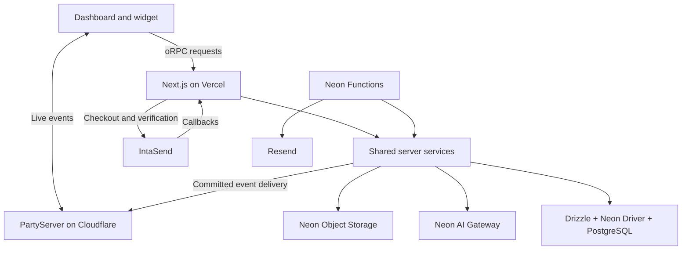

# Sema — Technical Stack & Architecture

> **For coding agents:** This document defines **how Sema is built**. Read it alongside [sema-prd.md](./sema-prd.md), which defines product behavior, and [GLOSSARY.md](./GLOSSARY.md), which defines vocabulary. Use the selected architecture below and documentation matching the installed package versions. Do not infer production readiness from this specification.

| Document control | Value |
| --- | --- |
| Version | **2.0 — Drizzle architecture** |
| Date | 6 October 2026 |
| Status | Selected technical baseline; implementation validation pending |
| Product | Website support SaaS for Kenyan service businesses |
| Delivery | Solo developer assisted by AI; founder-assisted pilot |
| Companion documents | PRD v2.0 and product glossary |
| Replaces | Technical stack v1.1: Data API runtime access and dbmate migrations |

## 1. Architecture at a glance

Sema uses Next.js for its dashboard, embedded chat interface and application backend. oRPC exposes typed operations. Server-side business services use Drizzle and the Neon Serverless Driver to access PostgreSQL. Neon also provides managed authentication, file storage, functions and AI model access. PartyServer on Cloudflare delivers live events. IntaSend collects M-Pesa payments.

**The database access decision is final for this baseline: Drizzle + Neon Serverless Driver.** Neon Data API is not part of the application runtime. PostgreSQL RLS remains a defense against accidental cross-workspace access, with identity context established by the trusted backend.

The PRD remains authoritative for product behavior. This document supersedes its earlier tentative technology mapping without changing pricing, quotas, retention or release scope.

### Product constraints

- Pilot for 3–5 businesses; no pilot business has yet been recruited.
- One website per workspace; three staff seats including the owner.
- Google-only staff login and anonymous, scoped visitor sessions.
- English-first AI grounded in uploaded PDF, DOCX, TXT and Markdown documents.
- KES 2,500/month with 500 AI replies; a 14-day trial with 100 replies.
- Manual monthly M-Pesa renewal; human chat has no monthly conversation quota.
- Publish AI answers only after completion, grounding checks and a final ownership check.
- Exclude email ticketing, WhatsApp, mobile apps, OCR, web crawling and autonomous business actions from v1.

## 2. Selected technology stack

| Layer | Technology | Responsibility |
| --- | --- | --- |
| Framework | Next.js App Router + React | Dashboard, widget iframe, backend procedures and callbacks |
| Language | TypeScript, strict mode | Application code and shared contracts |
| Styling | Tailwind CSS + shadcn/ui | Shared dashboard/widget design system |
| Forms | React Hook Form + Zod | Interactive forms and runtime input validation |
| Application API | Contract-first oRPC | Typed inputs, outputs, errors and authorization context |
| Client server-data state | TanStack Query via `@orpc/tanstack-query` | Fetching, pagination, mutations and cache reconciliation |
| ORM | `drizzle-orm` | Typed SQL queries, schema definitions and transactions |
| Database transport | `@neondatabase/serverless` | PostgreSQL queries over HTTP or WebSockets |
| Schema migrations | `drizzle-kit` + reviewed SQL | Schema changes, policies, grants, indexes and SQL functions |
| Database | Neon PostgreSQL + pgvector | Durable application data and vector retrieval |
| Authentication | Neon Auth / Managed Better Auth | Google sign-in and staff sessions |
| Authorization | Application checks + PostgreSQL grants/RLS | Actor permissions and workspace isolation |
| Background execution | Neon Functions + Function Triggers | AI work, ingestion, recovery and scheduled maintenance |
| File storage | Neon Object Storage | Private source files and temporary exports |
| Storage client | AWS SDK v3 S3 client and presigner | Authorized uploads, downloads and object management |
| AI interface | Vercel AI SDK + `@neon/ai-sdk-provider` | Generation, structured results and embeddings |
| AI gateway | Neon AI Gateway | Model access and provider billing |
| PDF / DOCX extraction | `unpdf` / `mammoth` | Bounded text extraction in background functions |
| Markdown display | `react-markdown` | Restricted rendering of completed answers |
| Real-time server | `partyserver` | Conversation and staff event rooms |
| Real-time client | `partysocket` | Browser sockets and reconnection |
| Token tooling | `jose` | Sema visitor and real-time JWT signing/verification |
| Payments | IntaSend | M-Pesa collection and payment verification |
| Transactional email | Resend + React Email | Invitations, billing and retention notices |
| Monitoring | Sentry + structured provider logs | Errors, diagnostics and correlation |
| Testing | Vitest + Playwright | Business rules, integration and browser journeys |
| Tooling | pnpm workspaces, ESLint, Prettier, esbuild | Dependencies, code checks and embed bundling |
| CI/CD | GitHub Actions + provider deployment tools | Validation, controlled migrations and deployment |
| Hosting | Vercel, Cloudflare, Neon | Web, real-time and managed backend respectively |

**Not selected:** Prisma, Neon Data API, dbmate, LangChain, a separate vector database, Turborepo, Redis, Redux and a separate workflow platform. Additions require a concrete implementation need; none is necessary merely to match another project's stack.

## 3. System boundaries

Next.js owns user-facing request validation, authentication, authorization, interactive operations and provider callbacks. Neon Functions execute persisted jobs. Shared services contain business rules; the database package owns queries and transaction boundaries. PartyServer delivers events and transient presence, while PostgreSQL owns message history, ownership and billing state.

Staff authentication occurs through Neon Auth. Selecting the ORM does not require self-hosting Better Auth or enabling the Data API. External model, payment, storage and email calls happen outside database transactions.

## 4. Repository structure

Use a single pnpm workspace with three deployable applications. No Turborepo is required initially.

| Path | Responsibility |
| --- | --- |
| `apps/web/app` | Next.js App Router pages, widget route and HTTP adapters; no extra `src/` directory |
| `apps/web/embed/index.ts` | Small vanilla TypeScript installation script |
| `apps/web/public/embed.js` | Generated embed bundle; git-ignored |
| `apps/realtime` | PartyServer classes, room routing and Wrangler configuration |
| `apps/functions` | Neon job handlers and scheduled work |
| `packages/contracts` | oRPC contracts, Zod schemas, public event types and safe constants |
| `packages/db/schema` | Drizzle definitions for Sema-owned tables |
| `packages/db/migrations` | Generated and custom reviewed SQL migrations |
| `packages/db` | Connection factories, scoped transaction helpers and repositories |
| `packages/server` | Shared business services and AI, storage, payment and email adapters |
| `tests` | Integration, browser and AI evaluation fixtures |
| `docs` | PRD, glossary, technical specification and runbooks |
| `neon.ts` | Neon function, bucket and trigger configuration |

Web and functions import server services and database repositories. PartyServer imports only compatible contracts and token utilities; it does not import Node-only services or the database package. Browser bundles never import privileged database modules.

Place the companion documents together in `docs` when creating the repository so their relative links remain valid. Folder paths in this document are the target structure, not a claim that an application repository already exists.

## 5. Rendering, client state and forms

### Component responsibilities

Use Server Components by default and introduce Client Components around interaction. A Client Component may still receive server-rendered initial HTML.

| Surface | Server work | Client work |
| --- | --- | --- |
| Marketing/pricing | Render and cache public content | Navigation interactions |
| Dashboard layout | Load identity and workspace context | Menus and sidebar interaction |
| Inbox | Fetch an initial authorized page | Selection, filters, pagination and live changes |
| Conversation | Fetch initial history and permissions | Composer, pending messages, typing and socket events |
| Knowledge | Fetch document metadata | Upload, processing status, retry and preview |
| Billing | Fetch current subscription and payment summary | Checkout input and pending-payment status |
| Settings | Load authorized configuration | Validated forms and feedback |
| Widget | Serve iframe shell and session endpoints | Chat, reconnects and browser persistence |

Do not mark the entire dashboard client-side for convenience. Pass only minimal serializable data to the browser and mark privileged modules server-only. Keep customer content, secrets and owner-only information out of unrelated component props.

### Fetching and cache ownership

- Server Components call authorized services or oRPC's server-side caller directly, without an HTTP round trip to the same app.
- Prefetch interactive page queries into a request-scoped TanStack Query client and hydrate through the documented integration.
- Use TanStack Query for server-owned records; React state for drafts, dialogs and temporary selection.
- Include workspace, resource and filters in query keys. Clear sensitive cached state on logout or identity change.
- Apply complete real-time updates by stable ID/version; invalidate queries when events do not contain enough information. Refetch authoritative history on reconnect or sequence gaps.
- Cache public content freely where appropriate. Keep tenant content and permissions request-scoped initially; shared caching requires explicit isolation and invalidation rules.

React Hook Form handles dashboard form interaction, with shared Zod input schemas. oRPC mutations are the default execution path. Server Actions are optional thin adapters for forms that benefit from them; they call the same authorized operations and do not create independent business logic.

## 6. Application API and security boundaries

Define contracts in `packages/contracts` with `@orpc/contract`, implement them in the web app and expose an internal RPC handler at `/rpc`. Use typed domain errors and explicit response objects. OpenAPI/REST exposure is deferred until an external consumer needs it.

Provider callbacks use dedicated Route Handlers, including `/api/webhooks/intasend`. Upload authorization uses an owner procedure; file bytes then travel directly to storage.

| Boundary | Required verification |
| --- | --- |
| `staffProcedure` | Valid Neon session and active workspace membership |
| `ownerProcedure` | Staff verification plus owner role |
| `visitorProcedure` | Valid visitor session, allowed workspace and owned conversation |
| Worker operation | Trusted service identity, permitted job kind and claimed job scope |

A workspace ID from a request is a selection, not authorization. Resolve it against the actor's permissions before creating trusted context. Verify resource ownership even when the caller belongs to the workspace. Recheck paid access and applicable limits at mutation time.

Every Route Handler, oRPC procedure and Server Action validates its own access. A protected layout, hidden button, CORS policy or TypeScript type is insufficient. Apply appropriate origin/CSRF controls to cookie-authenticated mutations. Log operational error codes and correlation IDs, not secrets or raw support content.

## 7. Drizzle and Neon Serverless Driver

### Primary runtime strategy

Use Drizzle's `neon-serverless` integration with the Neon driver's `Pool`/`Client` WebSocket transport as the initial runtime path. It supports the short interactive transactions needed for RLS context, billing, quotas and message/outbox writes. Database WebSockets are separate from PartyServer's chat connections.

Neon's HTTP transport supports individual queries and non-interactive transaction batches. It is an optional later optimization, not a second default query path. Never set context in one HTTP request and assume it applies to a later request. Any HTTP path must establish required context and execute protected work within the same database transaction.

Centralize driver configuration in `packages/db`. Follow the installed driver's runtime-specific connection lifecycle guidance: acquire one connection for a transaction, release it reliably, and close request-scoped pools/clients where required. Do not share checked-out connections or user identity between requests. Validate WebSocket support and any required runtime adapter in both Vercel and Neon Functions.

### Transaction discipline

Repositories performing protected work receive the scoped transaction object, not an unrestricted global database client. Use parameterized queries, row locks or guarded updates, constraints and idempotency keys where appropriate. Retry only identified transient database errors, with bounded attempts; retrying a transaction must not repeat an external side effect.

| Operation | Atomic database work |
| --- | --- |
| Message acceptance | Insert one message, allocate ordering, insert outbox/job intent |
| AI reservation | Check period/access and remaining allowance; reserve once |
| AI publication | Recheck ownership/version, sources and reservation; save reply, commit usage, insert event |
| Human takeover | Change owner/state, increment version and invalidate pending AI publication |
| Payment application | Record verified payment once and grant the correct purchased period |
| Document activation | Confirm current version and atomically switch active knowledge |

Do not hold locks while calling an AI model, IntaSend, Resend or object storage. Persist intent, perform external work, then finalize in a fresh guarded transaction. SQL functions remain available where they simplify atomic behavior; they are called through Drizzle, not a Data API RPC endpoint.

## 8. Authentication, RLS and database roles

### Staff and visitor identity

Neon managed authentication verifies staff identity; Sema owns workspace membership and roles. Staff use Google login. Configure production OAuth credentials and callback origins separately from development. Do not let application migrations take ownership of Neon's managed auth schema.

Visitors use Sema-issued scoped sessions and do not receive a database connection or staff identity. Use `jose` for token signing and verification, with explicit issuer, audience, allowed algorithm and expiry. Store a hash of the random resumable-session secret, with expiry and revocation state. Keep visitor credentials distinct from realtime tickets and service secrets. Final access/refresh lifetimes are implementation parameters to validate against browser continuity and revocation requirements.

### RLS design

Retain **application authorization, explicit workspace filters and PostgreSQL RLS**. These layers address different failures. The driver does not translate a Neon Auth session into database identity automatically.

Use separate migration and runtime credentials. Runtime roles are non-owner, non-superuser and have no `BYPASSRLS`. Use narrowly granted staff, visitor-service and worker capabilities; ordinary staff credentials cannot update payment entitlements or metering ledgers directly. Actual role names are migration details.

Implement a server-only scoped transaction helper with this sequence:

1. Verify staff session or visitor credential outside the transaction.
2. Begin a transaction using the appropriate restricted runtime role.
3. Set transaction-local context with parameterized `set_config(..., true)` calls. Proposed settings include actor ID, actor kind, requested workspace, and visitor/conversation ID when applicable.
4. Resolve active membership or visitor-session scope through policies/repositories that can safely check the verified actor. Reject invalid or revoked access.
5. Execute protected repository operations using this same transaction handle.
6. Commit or roll back, ensuring context cannot persist into the next request.

Policies must fail closed when required settings are absent. Staff policies check membership and allowed actions; visitor policies check the specific owned conversation, not just workspace equality. Use `USING` and `WITH CHECK` as needed. Avoid recursive membership policies: actor-scoped membership reads or a narrowly reviewed helper must make the initial membership lookup possible.

Transaction-local settings are asserted by trusted server code, not independently authenticated by PostgreSQL. They protect against accidental unscoped queries, not a compromised application server or leaked database credentials. Never accept arbitrary context settings from a client.

Use grants, constraints and restricted operations alongside RLS. Prevent self-promotion, client-written paid status and arbitrary usage adjustments. Review views and elevated functions for policy bypass. Default to invoker rights; any definer function needs minimal execute grants, fixed search path and explicit authorization.

Cross-workspace foreign references must be impossible through composite constraints or equivalent validated rules. Keep internal notes separate from public messages. Tests must run as the actual restricted roles, including concurrent requests that reuse pooled connections.

### Workers and platform operations

Workers establish context from a validated persisted job, never only a caller-supplied workspace ID. A cross-workspace dispatcher may claim jobs through a narrowly granted queue operation; tenant processing then runs scoped to the claimed job. Billing finalization and audited platform operations use dedicated restricted capabilities. Do not solve worker access by reusing migration credentials.

## 9. Schema and migration ownership

`packages/db` owns Drizzle schema definitions, inferred TypeScript types, repositories, migrations and custom SQL. Drizzle Kit replaces dbmate. Maintain one migration history.

Generate migrations from schema changes, inspect the SQL and supplement it for RLS, grants, SQL functions, extensions or indexes not fully represented by the selected Drizzle release. Exclude provider-managed auth objects and roles from destructive schema management. Verify migration diffs against the actual database.

Apply migrations to an isolated development/test branch first, then production through a controlled step. Do not use schema push as the production release process. Prefer additive changes and expand/contract migrations. Application rollback must remain compatible with the schema; avoid destructive down migrations as routine rollback.

| Domain | Principal records |
| --- | --- |
| Access | Workspaces, memberships, invitations, allowed origins |
| Chat | Visitor sessions, conversations, public messages, internal notes, ownership versions |
| Knowledge | Documents, immutable versions, chunks, embedding metadata, source references |
| AI usage | Attempts, reservations, committed replies, provider costs |
| Billing | Plan versions, orders, payments, paid periods, reconciliation and adjustments |
| Operations | Jobs, outbox events, audit records, email intents, rate counters |

Store money in integer minor units with explicit currency. Use UTC instants and Africa/Nairobi as the default display/business timezone. Allocate server-side conversation sequence numbers. Implement purchased-period rules from PRD Section 10.3 rather than assuming every month is 30 days.

## 10. Widget and real-time messaging

### Embed delivery

The loader at `apps/web/embed/index.ts` injects a launcher and lazily loaded Sema iframe, such as `/widget/[workspaceId]`. esbuild produces `public/embed.js` independently of Next.js; development watches it and production builds regenerate it. Start with a stable filename and a five-minute cache. The loader contains no React or database dependency.

The iframe shares the dashboard design system. Widget previews use the same components. Validate `postMessage` origin, source window and payload. Restrict framing with per-workspace CSP `frame-ancestors` using explicit allowed origins. A page-reported hostname is not authenticated proof; use it only alongside other controls. Development-origin exceptions must be explicit and cannot enable production access accidentally.

Test browsers with blocked/partitioned third-party storage. Do not assume iframe cookies or local storage always preserve identity. Implement a scoped resumable session and clearly explain the fallback when continuity is unavailable.

### Rooms and authorization

Use `partyserver` with `partysocket`, deployed through Wrangler. Enable hibernation where supported and preserve validated connection state.

| Room | Audience | Contents |
| --- | --- | --- |
| Conversation | Scoped visitor and authorized staff | Committed public messages, state, typing and answering status |
| Workspace | Authorized staff | Inbox summaries and safe operational notifications |

Never broadcast internal-note bodies, billing records or original documents into visitor rooms. Owner-only details are fetched through authorized HTTP; a staff event can simply announce that data changed.

Next.js mints room-specific realtime tickets after authorization. Start with a 60-second handshake-ticket expiry as an engineering default. Validate issuer, audience, algorithm, expiry, actor and exact room claims. Fetch a fresh ticket on reconnect. Ticket expiry alone does not terminate an established socket: implement revocation signals and a bounded authorization lease with forced reauthorization.

Authenticate backend publish requests separately, validate event schemas and redact connection-token URLs from logs. Client socket messages are limited to typing/presence controls with server-derived identity; durable writes use oRPC.

### Durable message flow

1. Client shows a pending message with a unique idempotency key.
2. Backend validates scope, access and limits.
3. A Drizzle transaction saves the message, sequence and outbox event.
4. The response confirms persistence, and the client reconciles the pending item.
5. Immediate delivery is attempted; a dispatcher retries undelivered events.
6. Clients deduplicate by ID/version and recover missing history from the API.

Delivery is at least once, not exactly once. Presence may disappear; acknowledged messages must remain durable. PartyServer is not the source of billing or conversation truth.

## 11. Knowledge, storage and AI

### Upload and extraction

Use private Neon buckets for knowledge and exports. Owner procedures issue short-lived presigned URLs for server-selected immutable keys, such as `workspaces/{workspaceId}/documents/{documentId}/versions/{versionId}/source.ext`.

Validate real object size and content after upload before processing. Use bounded parsing, decompression and extracted-text limits. Configure storage CORS for Sema's application/iframe origins. Confirm path-style/checksum SDK options against the actual Neon endpoint; do not copy compatibility workarounds blindly. Clean up failed/unconfirmed uploads and orphaned objects after a documented grace period.

Use `unpdf` for text PDFs, Mammoth raw-text extraction for DOCX, and direct text decoding for TXT/Markdown. Reject scanned-only, encrypted, corrupt or unsupported documents with actionable errors. Do not render uploaded HTML or Mammoth HTML output. Evaluate DOCX tables and policy lists because raw-text conversion loses formatting.

Persist ingestion stages: validate, extract, chunk, embed and activate. Failed replacement leaves the prior valid version active. Deletion blocks retrieval immediately, including a final source check before pending AI answers can publish.

### Retrieval and models

Store vectors in pgvector beside document/workspace metadata. Filter to authorized, active versions before selecting usable results. Benchmark filtered retrieval recall and index behavior; start simply and add indexes based on realistic document volume.

Use a heading/paragraph-aware splitter with sentence fallback and preserved references. Approximately 800-token chunks, 100-token overlap and top-five retrieval are evaluation starting points, not guaranteed production settings. Enforce actual model limits; character estimates are approximate.

Use Vercel AI SDK and `@neon/ai-sdk-provider` for model requests through **Neon AI Gateway**. This does not select Vercel AI Gateway. Current Neon documentation supports embeddings through the provider. Benchmark `qwen3-embedding-0-6b` at 1024 dimensions with cosine similarity first. Store model identifiers, dimensions and preprocessing versions; changing the embedding model requires controlled re-indexing.

Choose classification, answering and checking models after English quality/cost evaluation. Do not inherit another project's model IDs, reasoning settings, similarity thresholds or follow-up heuristics without validation. Keyword retrieval can be added within PostgreSQL if exact-name/code failures justify it.

### Checked-answer pipeline

1. Persist the visitor message and an AI job intent if the conversation is AI-owned.
2. Classify bounded public context. Explicit human/action requests hand off; off-topic requests receive fixed refusals.
3. Check entitlements and atomically reserve an AI unit before answer generation.
4. Retrieve active sources and generate a bounded draft outside a database transaction.
5. Check grounding/conflicts and select answer, clarification or handoff.
6. In a fresh transaction, recheck ownership version, relevant message sequence, active sources, access and reservation; commit the answer, usage and delivery event together.
7. Release failed/stale reservations and record all underlying provider costs.

Show Answering while processing. Never publish unchecked partial text. Internal provider streaming may be consumed without exposing it to visitors. A self-reported confidence score is not enough to establish grounding. Treat history/documents as untrusted data and expose no tools for changing orders, bookings or payments.

Render completed AI messages through restricted `react-markdown`: disable raw HTML, remote images, MDX, executable content and unnecessary plugins; constrain links. Render ordinary visitor/staff text plainly unless a supported format is explicitly defined. Use initials and a local Sema icon for avatar fallbacks.

## 12. Background execution and recovery

Use Neon Functions with PostgreSQL-backed jobs/outbox records. Triggers start work; persistence establishes what must be recovered. A `202` response, `after()` or `waitUntil` alone does not provide durable execution.

A job records kind, workspace, deduplication key, stage, status, attempts, next retry time, lease owner/expiry and a redacted error. Claim work atomically, limit concurrency, checkpoint long ingestion, and recover expired leases. Use backoff, jitter, bounded retries and a visible permanently-failed state.

Declare functions, buckets and triggers in `neon.ts`. Start with one jobs deployment in `apps/functions` with separate handlers; split deployments when resource or privilege boundaries justify it. Verify platform trigger authentication rather than trusting an arbitrary invocation header.

| Work | Start | Recovery / guarantee |
| --- | --- | --- |
| Document ingestion | Authorized upload/storage event | Resume stages; activate a version once |
| AI generation | Immediate dispatch after persisted job | Recover lost dispatch; prevent stale or duplicate publication |
| Event delivery | After database commit | Retry persisted outbox with client deduplication |
| Payment reconciliation | Callback or scheduled pending-order check | One financial effect per verified payment |
| Email | Persisted email intent | Deduplicate and track provider delivery failures |
| Maintenance | Scheduled trigger | Reservations, orphan files, rate counters, expiry and retention |

Schedules are a recovery mechanism, not the normal latency path for chat. Account for schedules keeping database compute awake. Defer a separate workflow service unless the recovery spike shows custom orchestration becoming substantial.

## 13. Billing and email

IntaSend collects M-Pesa payments; Sema owns subscription periods and usage. Checkout uses server-owned versioned prices, order references and currency. Treat client redirects and callback claims as signals, not proof of payment.

Validate the provider's documented callback authentication/challenge mechanism, verify status server-to-server, match expected reference/amount/currency, then apply the result in an idempotent database transaction. Record ambiguous or conflicting results for review. Do not make a provider call while holding the financial transaction open.

Preserve PRD semantics: early renewal queues a period without resetting current usage; paid expiry grants three days for existing human threads only; trial expiry and deliberate cancellation have no grace; later access is read-only history/billing/export. Exhausted AI allowance alone does not block eligible human chat. Count only completed generated answers/clarifications committed to visible history as AI replies.

Use Resend and React Email for invitations, payment confirmations, renewal reminders and retention notices. Verify the sending domain and email authentication; persist delivery intents and track failures. Development uses test delivery and sandbox payments. Email ticketing and automated visitor follow-up remain excluded.

Before collecting real payments, resolve tax/fee display, receipts, refund handling, production onboarding and financial-record retention. This specification does not assert legal compliance.

## 14. Monitoring, abuse protection and privacy

Use atomic PostgreSQL counters initially for action, visitor and workspace rate limits. Bound inputs, uploads, AI concurrency and retries. Apply socket limits and available perimeter controls before expensive work. Move transient counters to a dedicated service only if database cost or contention requires it; purchased AI allowance stays in the transactional database.

Sentry captures application errors. Structured Vercel/Neon/Cloudflare logs carry correlation IDs across requests, jobs, model calls and delivery attempts. Disable session replay and raw AI prompt/completion capture initially. Avoid full messages, document contents, credentials and phone numbers in logs.

Alert on backlog age, stalled ingestion, payment reconciliation delay, AI failures, undelivered events and unusual spending. Monitor recovery schedules themselves. Configure an independent health check before the pilot to detect a total outage.

Track model cost by workspace, task and attempt, including failed generations. Provide workspace/global AI suspension without removing eligible human support. Alerts do not guarantee a provider hard spending cap. The monthly budget ceiling remains unset.

Conversation retention is 180 days since the last message; expired-workspace retention is 90 days, applying the earlier deadline. Reactivation cancels the workspace expiry deadline without resetting conversation age. Delete originals, chunks and exports consistently. Financial records have a separately approved schedule. Verify provider deletion and backup behavior before promising specific purge deadlines.

## 15. Environments, CI/CD and recovery

Separate development, preview and production credentials. Use synthetic customer data and sandbox payments. Neon branching can copy database/auth/storage state; do not automatically expose production data in previews. Keep a clean fixture base for test branches.

| Deployment | Tool | Control |
| --- | --- | --- |
| Web app | Vercel Git integration | CI and migration compatibility gates before production |
| Realtime | Wrangler | Separate environment Workers, bindings and secrets |
| Functions/storage/triggers | Neon CLI + `neon.ts` | Explicit target branch and environment |
| Schema | Drizzle Kit migration step | Separate migration credentials and reviewed SQL |

Use ESLint flat config, `eslint-config-next`, `eslint-config-prettier`, Prettier and `prettier-plugin-tailwindcss`. Pin the package manager and commit the lockfile. CI uses frozen-lockfile installation.

Required scripts to implement: `dev`, `build`, `typecheck`, `lint`, `format:check`, `test`, `test:e2e`, `db:generate`, `db:migrate`, `realtime:deploy:dev` and `functions:deploy:dev`. Drizzle infers query types from its schema; no Data API type-generation or schema-cache refresh step remains.

Production secrets include role-specific runtime database URLs, a separately held migration URL, auth configuration, gateway/storage credentials, IntaSend/Resend credentials, visitor/realtime signing keys and publication secrets. Document variable names in `.env.example`; never expose private credentials through `NEXT_PUBLIC_*`. Do not rely on a broadly privileged auto-injected database URL for normal worker processing.

Choose regions after verifying availability of all required Neon services, colocate database-bound compute where possible and measure latency from Kenya. No Kenyan data-residency promise is made.

Test database restoration into an isolated environment, including file references and subsequent payment reconciliation. Reapply deletion records after restore. Provider backups are not a substitute for a tested procedure. Deploy additive migrations before dependent code and keep event contracts compatible across web, functions and Workers.

## 16. Verification and release gates

Use Vitest for business rules and real-database integration tests, and Playwright for browser journeys. Mock external providers in routine tests and run separate sandbox contract checks. Type checking cannot establish isolation, transaction correctness or recovery.

| Scenario | Required result |
| --- | --- |
| Cross-workspace query/write | Denied through repositories, RLS, object access and realtime rooms |
| Missing or leaked transaction context | Missing context denies access; pooled connections cannot inherit another request's scope |
| Visitor changes IDs | Cannot retrieve another conversation or internal notes |
| Staff removal | New requests denied and existing realtime access revoked within the defined lease |
| Last AI unit requested concurrently | At most the available allowance can be committed |
| Human takeover/new message during generation | Stale answer cannot publish or consume reply allowance |
| Duplicate or delayed payment callback | One correct entitlement effect or explicit review |
| Lost acknowledgement/reconnect | One persisted message and complete ordered history |
| Worker termination/duplicate trigger | Work recovers without duplicate business effects |
| Failed replacement/deleted knowledge | Prior valid version survives failure; deleted content cannot support new publication |
| Trial/paid expiry, grace and reactivation | Exact PRD lifecycle behavior |
| Restricted browser storage | Usable widget with clear continuity fallback |
| Restore and retention | Recoverable records without re-exposing already-deleted content |
| English quality evaluation | Grounded answers and appropriate clarification/refusal/handoff meet PRD gates |

## 17. Implementation plan and open checks

| Stage | Deliverable | Exit evidence |
| --- | --- | --- |
| 1. Foundations | Workspace repo, Google auth, Drizzle driver, roles/RLS, deployable Workers/functions | Authenticated scoped transactions work on both Node runtimes; isolation tests pass |
| 2. Live support | Inbox, iframe, oRPC send, message/outbox transactions, sockets | Durable send, reconnect, staff access and handoff demonstrated |
| 3. Knowledge and jobs | Private uploads, parsers, staged ingestion, vector retrieval | Crash recovery, versioning and deletion tests pass |
| 4. AI | Classification, retrieval, checked answers, reservations | Quality, cost, takeover and concurrency gates pass |
| 5. Paid access | IntaSend, reconciliation, periods, metering and email | Sandbox payment lifecycle and duplicate/late scenarios pass |
| 6. Pilot operations | Monitoring, restore, retention and real-site tests | PRD release gate passes and operating costs are understood |

No further product interview is required to begin foundations. Resolve these implementation checks before their dependent stage:

- Exact compatible package versions and supported Node runtime.
- Drizzle transaction helper, restricted roles, non-recursive RLS policies and connection lifecycle in both runtimes.
- Production generation/checking models and retrieval calibration; Qwen3 is an embedding candidate, not a quality guarantee.
- Parser behavior on realistic, corrupt and oversized inputs.
- Visitor token lifetimes, browser continuity and connection authorization lease.
- Regions, function limits, schedule behavior, backup windows and object recovery.
- Monthly build/production budget and independent health-monitor choice.
- IntaSend production onboarding and remaining financial/privacy launch decisions.

Prefer suitable free allowances during development. Budget explicitly for Neon AI Gateway's paid-plan/credit requirements, eligible commercial Vercel hosting, Cloudflare, storage/egress, email, monitoring and payment fees. No paid activation is performed by creating this document.

## 18. Versions, sources and change record

This specification selects technologies, not an untested dependency manifest. At bootstrap, record exact installed versions and verification dates. Prefer a compatible supported stable set; use a beta/RC only for a required capability with a documented reason and tested fallback. In particular, do not copy oRPC, Drizzle or AI SDK examples across incompatible major versions.

| Subject | Primary documentation |
| --- | --- |
| Next.js rendering/security | [Components](https://nextjs.org/docs/app/getting-started/server-and-client-components), [authentication](https://nextjs.org/docs/app/guides/authentication) |
| oRPC contracts/integration | [Contracts](https://orpc.dev/docs/contract/implementation), [Next.js](https://orpc.dev/docs/adapters/next), [TanStack Query](https://orpc.dev/docs/integrations/tanstack-query) |
| Drizzle + Neon | [Connection guide](https://orm.drizzle.team/docs/connect-neon), [RLS](https://orm.drizzle.team/docs/rls), [migrations](https://orm.drizzle.team/docs/drizzle-kit-migrate) |
| Neon Serverless Driver | [Driver repository and transaction/runtime guidance](https://github.com/neondatabase/serverless) |
| PostgreSQL authorization | [Row security](https://www.postgresql.org/docs/current/ddl-rowsecurity.html) |
| Managed backend | [Neon backend](https://neon.com/blog/neon-backend-is-ga), [managed auth](https://neon.com/docs/auth/overview) |
| AI | [Vercel AI SDK](https://ai-sdk.dev/docs/introduction), [Neon embeddings/provider](https://neon.com/docs/ai-gateway/embeddings), [gateway credits](https://neon.com/docs/ai-gateway/prepaid-credits) |
| Jobs | [Scheduled functions](https://neon.com/blog/your-neon-functions-can-now-run-on-a-schedule), [storage triggers](https://neon.com/blog/when-a-file-is-uploaded-run-the-job-on-neon) |
| Real-time | [Cloudflare PartyKit repository](https://github.com/cloudflare/partykit), [PartyServer](https://github.com/cloudflare/partykit/blob/main/packages/partyserver/README.md) |
| File handling | [unpdf](https://github.com/unjs/unpdf), [Mammoth](https://github.com/mwilliamson/mammoth.js), [AWS SDK S3](https://docs.aws.amazon.com/sdk-for-javascript/v3/developer-guide/javascript_s3_code_examples.html) |
| Browser/token tooling | [react-markdown](https://github.com/remarkjs/react-markdown), [jose](https://github.com/panva/jose), [esbuild](https://esbuild.github.io/api/) |
| Payments | [IntaSend collection](https://developers.intasend.com/reference/payment-collection/), [webhooks](https://developers.intasend.com/guides/webhooks/) |
| Operations | [Resend](https://resend.com/pricing), [Sentry](https://sentry.io/pricing/), [Playwright CI](https://playwright.dev/docs/ci), [Vercel plans](https://vercel.com/pricing) |

Sources were reviewed during the October 2026 architecture discussion; recheck provider limits and version-specific instructions at implementation. Package compatibility, deployment and runtime behavior have not yet been tested.

**Version 2.0 decision record:** The founder selected Drizzle + Neon Serverless Driver on 6 October 2026. Runtime Data API access and dbmate are replaced by server-side Drizzle access and Drizzle Kit. RLS now uses explicit backend-established transaction context, rather than Data API JWT propagation. Neon managed auth, oRPC, PartyServer, AI, storage, billing and the product requirements remain in place. Historical comparison material is omitted so this document presents one current implementation baseline.
